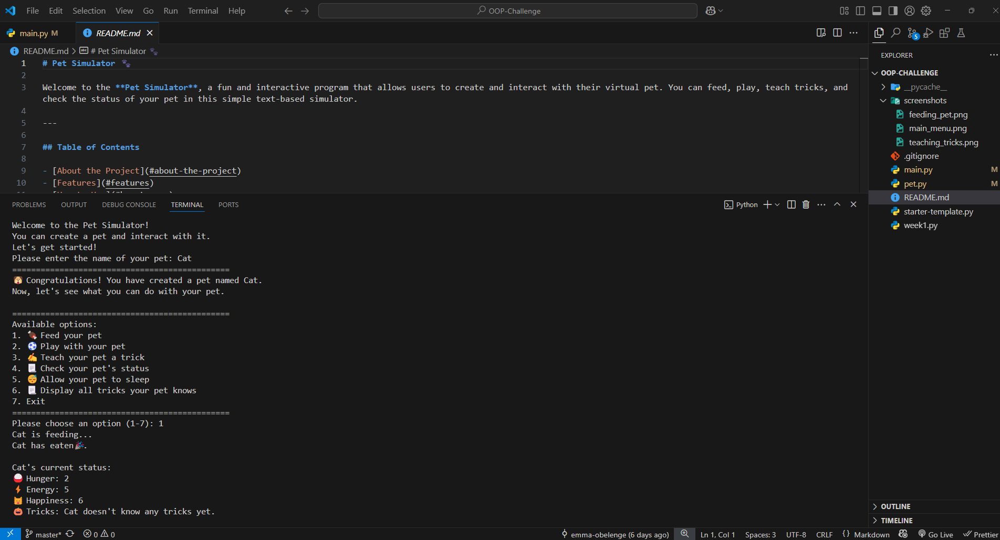
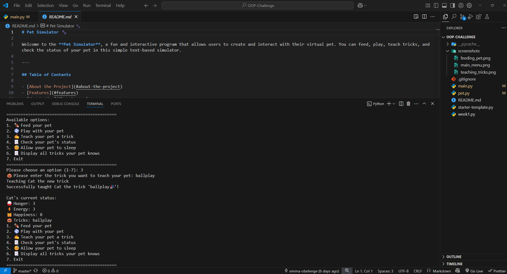
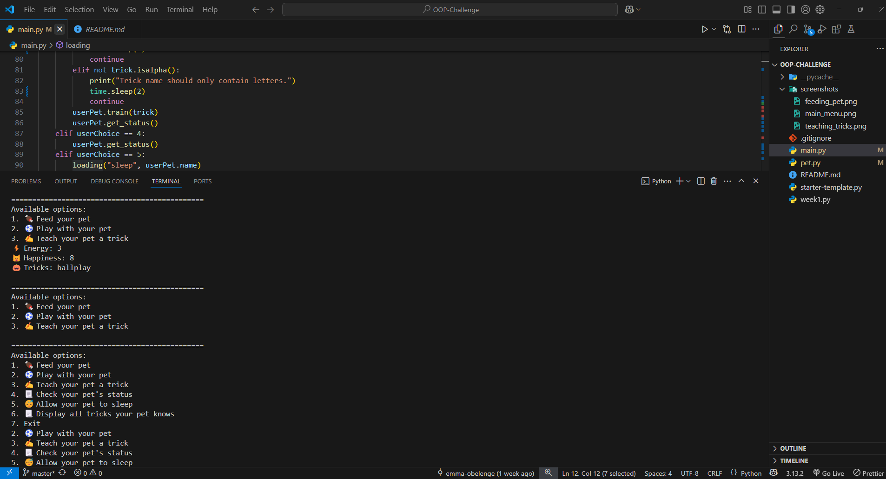

# Pet Simulator 🐾

Welcome to the *Pet Simulator*, a fun and interactive program that allows users to create and interact with their virtual pet. You can feed, play, teach tricks, and check the status of your pet in this simple text-based simulator.

## About the Project

The *Pet Simulator* is a Python-based program designed to simulate the experience of owning and interacting with a virtual pet. It uses object-oriented programming (OOP) principles to create a Pet class with attributes and methods that allow users to perform various actions with their pet.

This project is beginner-friendly and demonstrates the use of:

- *Classes and objects*
- *Methods and attributes*
- *User input handling*
- *Loops and conditional statements*
- *Basic error handling*

---

## Features

- *Create a Pet*: Name your pet and start interacting with it.
- *Feed Your Pet*: Keep your pet happy and healthy by feeding it.
- *Play with Your Pet*: Spend quality time with your pet to increase its happiness.
- *Teach Tricks*: Teach your pet new tricks and watch it grow smarter.
- *Check Status*: View your pet's current status, including its health and happiness levels.
- *Sleep Mode*: Allow your pet to rest and recharge.
- *Show Tricks*: Display all the tricks your pet has learned.
- *Exit Gracefully*: Close the simulator with a friendly goodbye message.

---

## Screenshots

## Technologies Used

### Programming Language

- *Python*

### Libraries

- *time*: Used for delays and animations.

---

## Authors and Contributors

This project was developed as part of the *PLP Academy Group Assignment*. Below are the contributors:

### Group 193 Members

#### Mike Ayoti

- *Role*: Group Leader
- *GitHub*: [@MykeShale](https://github.com/MykeShale)

#### Matukane Bless

- *Role*: Member
- *GitHub*: [@MatukaneBless](https://github.com/MatukaneBless)

#### Viona Okello

- *Role*:  Member
- *GitHub*: [@Viona-1](https://github.com/Viona-1)

#### Francis Njuguna

- *Role*:  Member
- *GitHub*: [@Francis-Njuguna](https://github.com/Francis-Njuguna)